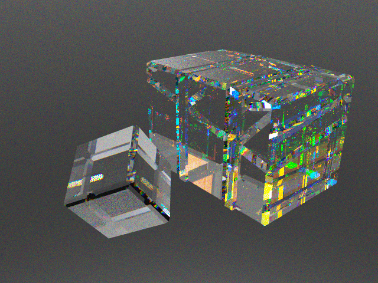

# Coldworking CAD

A web-based CAD system for designing coldworked glass sculptures in the
style of Jack Storms — optical crystal blocks and dichroic glass plates,
repeatedly cut, glued, and polished — with a physically-based GPU spectral
ray tracer for visualization.

Everything is plain ES modules: **no build step, no dependencies**.



*The demo sculpture rendered by the CPU reference tracer (128 spp — the
colored speckle is spectral sampling noise that converges away; the GPU
version accumulates thousands of samples interactively). Visible: seamless
glue joints, dichroic color splitting inside the laminate, and dispersion
sparkle on the beveled edges.*

## Running

Serve the directory with any static file server and open `index.html`:

```bash
python3 -m http.server 8000
# then open http://localhost:8000/
```

A browser with WebGL2 is required (any current Chrome/Firefox/Safari/Edge).
The path tracer additionally needs the `EXT_color_buffer_float` extension
(present on effectively all desktop GPUs).

Click **Demo** in the toolbar to load a sample sculpture, then open the
**Render** tab.

## Design principles

The app encodes the real-world constraints of coldworking directly:

- **Flat faces only.** Every piece is a convex polyhedron. There is no
  curved geometry anywhere in the kernel.
- **Every shaping operation is a plane.** Saw cuts, angled cuts, bevels,
  and face grinding are all implemented as half-space clips — the single,
  robust geometric primitive the whole kernel is built on.
- **Sculptures are dense.** Pieces are glued face-to-face with no air gaps.
  At export time, coincident faces between pieces are detected geometrically:
  same-material glue joints *disappear* (the "invisible seam" of good
  coldworking), different-material joints become a single internal
  refractive interface, and coated faces become spectral splitters.
- **Units are inches.** Dichroic plates are 1/8″ thick by default.

## Features

### Design tab

| Tool | What it does |
|------|--------------|
| Select (Q) | Pick pieces/faces; duplicate, delete, reassign material |
| Add Block (B) | New crystal block with exact dimensions |
| Slice (S) | Plane cut: axis + tilt + offset, anchored by clicking; or cut the selection into **N equal slabs** (the "cut the laminated bar into identical tiles" workflow). With nothing selected, the cut saws through every piece in its path |
| Glue (G) | Mate two faces flush (normals opposed, centers aligned) |
| Dichroic (P) | Attach a 1/8″ dichroic plate to any face, coated side in or out |
| Move (M) / Rotate (R) | Numeric transforms; arrow-key nudging |
| Array (A) | Linear arrays (tiling) and rotational arrays (radial cores) |
| Extrude (E) | Move a face along its normal to lengthen/shorten a piece |
| Bevel (V) | Chamfer all sharp edges — the final polish pass |
| Measure (X) | Corner-snapped distance measurement |

Undo/redo (Ctrl+Z / Ctrl+Shift+Z), per-piece visibility, piece outliner.

### Materials library

Pre-populated with real optical glasses (index n_d and Abbe number V_d from
catalog data — dispersion is derived from these):

- Schott N-BK7 / K9 (the standard "optical crystal"), fused silica,
  24% lead crystal, F2 and N-SF11 flints, SF66 extra-dense flint.

Dichroic coatings follow the Coatings-By-Sandberg "Reflect/Transmit" naming
(Blue/Gold, Cyan/Red, Magenta/Green, Yellow/Blue, Red/Cyan, Green/Magenta…),
modeled as steep-edged reflection bands with T = 1 − R, like real
dielectric stacks. You can define custom crystals (n_d, V_d) and custom
dichroics (1–2 reflection bands) — both are saved with the project.

### Saving & versioning

- Autosave to browser storage on every change.
- **Save Version** snapshots named milestones; restore any version later
  (restoring is itself undoable).
- **Export/Import** `.coldwork.json` project files for backup and sharing.

### Render tab — GPU spectral path tracer

Progressive path tracing in a WebGL2 fragment shader (BVH-accelerated):

- **Hero-wavelength spectral rendering**: each path carries one wavelength;
  CIE 1931 color matching converts spectra to color. Dispersion ("fire")
  falls out of the per-wavelength Cauchy IOR computed from each glass's
  Abbe number.
- **Correct glued-glass optics**: internal interfaces refract with the true
  relative IOR of the two glasses; same-material joints are seamless.
- **Dichroic plates** split light by wavelength using their reflectance
  spectra, combined with the substrate Fresnel term.
- Fresnel-weighted reflection/refraction with total internal reflection,
  Beer–Lambert absorption, studio lighting environment, optional matte
  floor, ACES tonemapping, adjustable bounces/exposure/resolution.
- **Save PNG** of the current accumulation.

### Standalone visualizers

`render.html` is a browser-based standalone viewer for `.render.json` scene
files (Render tab → **Export scene**). Drop a file on it and orbit.

**[`viewer/`](viewer/README.md)** is a compiled native viewer (Rust + wgpu:
Vulkan on Linux, Metal on macOS) running the same spectral algorithm in a
GPU compute shader. It **watches the loaded file and hot-reloads it on
change**, so you can keep exporting from the CAD app and see updates live:

```bash
cd viewer && cargo build --release
./target/release/coldworking-viewer ../demo.render.json
```

## File formats

**`.coldwork.json`** — full project: pieces (convex polyhedra + transforms),
materials, name. Format: `{"format": "coldworking-cad", "version": 1, ...}`.

**`.render.json`** — flattened render scene:

```jsonc
{
  "format": "coldworking-render-scene",
  "materials": [ {"cauchyA": 1.0, "cauchyB": 0.0, "tint": [r,g,b]}, ...], // [0] = air
  "coatings":  [ {"bins": [/* 32 reflectance samples, 380–730nm */]} ],
  "triangles": {
    "positions": [/* 9 floats per tri */],
    "normals":   [/* 3 floats per tri, geometric */],
    "matFront":  [/* material index on the side the normal points to */],
    "matBack":   [/* material index behind */],
    "coating":   [/* coating index or -1 */]
  },
  "bbox": {"min": [...], "max": [...]}
}
```

## Development

```bash
node tests/test_geometry.mjs       # geometry kernel
node tests/test_model_export.mjs   # document model + render export
node tests/test_raytrace_cpu.mjs   # CPU mirror of the GPU tracer physics

# CPU reference render of the demo scene (validates the whole pipeline):
node tools/render_cpu.mjs 480 360 64 out.png

# Export the demo as a .render.json for the native viewer:
node tools/export_demo_scene.mjs demo.render.json

# Native viewer tests (validates WGSL shaders + scene loading, no GPU needed):
cd viewer && cargo test
```

Source layout:

```
js/math.js               vec3 / mat4 / quaternion
js/geometry.js           convex-polyhedron kernel (clip, chamfer, extrude, raycast)
js/spectra.js            CIE color matching, Cauchy dispersion, dichroic spectra
js/materials.js          material library + real-world presets
js/model.js              document model: pieces, ops, undo/redo, serialization
js/export.js             render-scene extraction (glue-joint interface detection)
js/store.js              autosave, versions, file import/export
js/viewport.js           WebGL2 editor viewport (raster, picking, orbit)
js/ui.js                 tools, panels, dialogs, render-tab wiring
js/raytracer/bvh.js      BVH builder
js/raytracer/pathtracer.js  WebGL2 spectral path tracer
js/demo.js               demo sculpture
render.html              standalone browser visualizer
viewer/                  native real-time viewer (Rust + wgpu, hot-reload)
```
